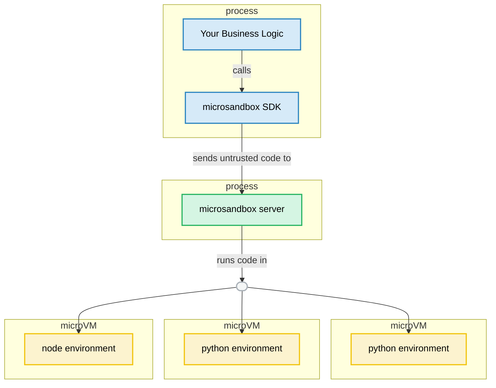

```mermaid
flowchart TB
    %% ── Client side ──────────────────────────
    subgraph ClientProcess["process"]
        A["Your Business Logic"]
        B["microsandbox SDK"]
        A -->|calls| B
    end

    %% ── Server side ─────────────────────────
    subgraph ServerProcess["process"]
        C["microsandbox server"]
    end
    B -->|sends untrusted code to| C

    %% ── Branching hub ───────────────────────
    D([ ])
    C -->|runs code in| D

    %% ── Individual MicroVMs ────────────────
    subgraph VM1["microVM"]
        VM1S["python environment"]
    end

    subgraph VM2["microVM"]
        VM2S["python environment"]
    end

    subgraph VM3["microVM"]
        VM3S["node environment"]
    end

    D --> VM1S
    D --> VM2S
    D --> VM3S

    %% ── Styling ─────────────────────────────
    style A    fill:#D6EAF8,stroke:#2E86C1,stroke-width:2px,color:#000000
    style B    fill:#D6EAF8,stroke:#2E86C1,stroke-width:2px,color:#000000
    style C    fill:#D5F5E3,stroke:#28B463,stroke-width:2px,color:#000000
    style D    fill:#F4F6F6,stroke:#ABB2B9,stroke-width:2px,color:#000000
    style VM1S fill:#FCF3CF,stroke:#F1C40F,stroke-width:2px,color:#000000
    style VM2S fill:#FCF3CF,stroke:#F1C40F,stroke-width:2px,color:#000000
    style VM3S fill:#FCF3CF,stroke:#F1C40F,stroke-width:2px,color:#000000
```
